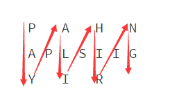

# Reverse Integer（翻转整数）

## 翻译 
字符串“PAYPALISHIRING”通过一个给定的行数写成如下这种 Z 型模式：  
P   A   H   N  
A P L S I I G  
Y   I   R  

然后一行一行的读取：“PAHNAPLSIIGYIR”

写代码读入一个字符串并通过给定的行数做这个转换：

string convert(string text, int nRows);

调用 convert("PAYPALISHIRING", 3)，应该返回"PAHNAPLSIIGYIR"。

## 原文
The string "PAYPALISHIRING" is written in a zigzag pattern on a given number of rows like this: (you may want to display this pattern in a fixed font for better legibility)
  
P   A   H   N  
A P L S I I G  
Y   I   R  

And then read line by line: "PAHNAPLSIIGYIR"  
Write the code that will take a string and make this conversion given a number of rows:

string convert(string text, int nRows);  
convert("PAYPALISHIRING", 3) should return "PAHNAPLSIIGYIR".

如果还是没明白题目的意思，看下图吧……



```
public class Solution
{
    public string Convert(string s, int numRows)
    {
        if (numRows == 1)
            return s;
        StringBuilder strBuilder = new StringBuilder();
        int lengthOfGroup = 2 * numRows - 2;        // 如上图所示，每组的长度为4     
        for (int row = 0; row < numRows; row++)      // 按从第0行到numRows-1行的顺序遍历  
        {
            if (row == 0 || row == numRows - 1)        // 此处负责第0行和numRows-1行
            {
                for (int j = row; j < s.Length; j += lengthOfGroup)
                {
                    strBuilder.Append(s[j]);
                }
            }
            else                   // 此处负责第0行和numRows-1行之间的所有行
            {
                int currentRow = row;           // 在当前行中向右移动（看上图）
                bool flag = true;
                int childLenOfGroup1 = 2 * (numRows - 1 - row);                //  怎么说呢……中间行的各个索引吧
                int childLenOfGroup2 = lengthOfGroup - childLenOfGroup1;

                while (currentRow < s.Length)
                {
                    strBuilder.Append(s[currentRow]);
                    if (flag)
                        currentRow += childLenOfGroup1;
                    else
                        currentRow += childLenOfGroup2;
                    flag = !flag;
                }
            }
        }
        return strBuilder.ToString();
    }
}
```

C++ 的代码肯定是有的：

```
class Solution {
public:
    string convert(string s, int numRows) {      
        if(numRows==1)
            return s;
        string str="";
        int lengthOfGroup=2*numRows-2;
        for(int row=0;row<numRows;row++){
            if(row==0||row==numRows-1){
                for(int currentRow=row;currentRow<s.length();currentRow+=lengthOfGroup){
                    str+=s[currentRow];
                }
            }
            else{
                int currentRow=row;
                bool flag=true;
                int childLenOfGroup1=2*(numRows-1-row);
                int childLenOfGroup2=lengthOfGroup-childLenOfGroup1;
                while(currentRow<s.length()){
                    str+=s[currentRow];
                    if(flag)
                        currentRow+=childLenOfGroup1;
                    else
                        currentRow+=childLenOfGroup2;
                    flag=!flag;
                }
            }
        }
        return str;   
    }
};
```

至于 Java 嘛，当然也有……不过每次我都是直接把 C# 的代码拷贝过去然后改改就好了。

```
public class Solution {
    public String convert(String s, int numRows) {
          if (numRows == 1)
              return s;
          StringBuilder strBuilder = new StringBuilder();
          int lengthOfGroup = 2 * numRows - 2;       
          for(int row=0; row < numRows; row++){
              if (row == 0 || row == numRows - 1){
                  for(int currentRow = row; currentRow < s.length(); currentRow += lengthOfGroup){
                      strBuilder.append(s.charAt(currentRow));
                  }
              }
              else{
                  int currentRow = row;        
                  boolean flag = true;
                  int childLenOfGroup1 = 2 * (numRows - 1 - row);           
                  int childLenOfGroup2 = lengthOfGroup - childLenOfGroup1;
                  while (currentRow <s.length()){
                      strBuilder.append(s.charAt(currentRow));
                      if (flag)
                          currentRow += childLenOfGroup1;
                      else
                          currentRow += childLenOfGroup2;
                      flag = !flag;
                  }
              }
          }
          return strBuilder.toString();
      }
}
```