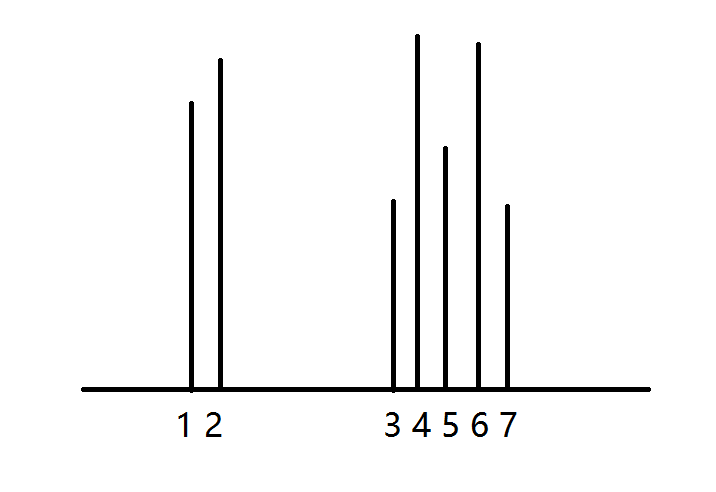

# Container With Most Water（最大水容器）

## 翻译 
给定 n 个非负整数 a1,a2,...,an，其中每个代表一个点坐标（i,ai）。

n 个垂直线段例如线段的两个端点在（i,ai）和（i,0）。

找到两个线段，与 x 轴形成一个容器，使其包含最多的水。

备注：你不必倾倒容器。

## 原文
Given n non-negative integers a1, a2, ..., an,   
where each represents a point at coordinate (i, ai). 

n vertical lines are drawn   
such that the two endpoints of line i is at (i, ai) and (i, 0). 

Find two lines, which together with x-axis forms a container,   
such that the container contains the most water.

Note: You may not slant the container.

题目的意思是，数组中的每个数对应一条线段的长度，索引对应 x 坐标，两个索引可以组成一个底部的宽，高度就是前面所说的线段的长度，而既然是要盛水，高度就是两个线段中较短的一个。

那么该怎么去解题呢？

我水平不行，英文也不行，所以每次一开始都是用最简单的方法，旨在试试有没有理解题目的意思，即便超出时间 / 空间限制也没事。

```
public int MaxAera(int[] height)
{
    int area = 0;
    for (int i = 0; i < height.Length; i++)
    {
        for (int j = i + 1; j < height.Length; j++)
        {
            if (height[i] < height[j])
                area = Math.Max(area, countArea(height, i, j));
        }
    }
    return area;
}

public int countArea(int[] height, int x, int y)
{
    int h = height[x] > height[y] ? height[x] : height[y];
    int info = h * (y - x);
    return info;
}
```

很明显这样是不行的……

那有那些部分可以简化呢？

前面的方法是从数组左侧开始逐个向右遍历所有情况，但明显可以从两侧向中间进发，通过对应的 max 函数来保留最大的面积。

当从左边进入到图中线段 1 位置，右边进入到线段 5 的时候。你不会想着右边继续进入线段 6 和 7，因为你就是从那边过来的。

那么是该左边的往右走，还是右边的往左走呢？

如果是右边的往左走，虽然线段 1 变成了线段 2，但是线段1到线段5的距离比线段 2 大，因此面积也大。所以走了之后面积反而小了。

如果是右边的往左走，亲自行脑补：线段 3 和线段 4 是在同一位置，如果是到了线段 4，那么容器的高度将从原本的线段 5 的长度变成线段 1 的长度，（虽然由于距离的变小，总面积仍可能变小，但请继续往下看），而如果到了线段 3，虽然高度变小了，宽度变小了，但，那又何妨呢？因为你的 maxArea 还是在那里的，每次的计算后，当且仅当高度超过原本的高度之后才会覆盖原来的值。

```
maxArea = Max(maxArea,newArea);
```

也就是说，高度如果没有超过，就没有什么影响。



至于你说它会不会因为自增和自减而发生越界，如果

```
int[] height = {10, 1, 2, 3, 4, 5, 6, 7, 11};
```

假设这里的 10 和 11 对应线段 1 和线段 6，请自行脑补：去掉线段 7，既然线段 1 短于线段 6，那么发生的是 left++，而不是 left–。所以，并不会越界的。反之，亦然。

```
public class Solution
{
    public int MaxArea(int[] height)
    {
        int left = 0, right = height.Length - 1;
        int maxArea = 0;
        while (left < right && left >= 0 && right <= height.Length - 1)
        {
            maxArea = Math.Max(maxArea, Math.Min(height[left], height[right]) * (right - left));
            if (height[left] > height[right])
            {
                right--;
            }
            else
            {
                left++;
            }
        }
        return maxArea;
    }
}
```

明天继续，加油！