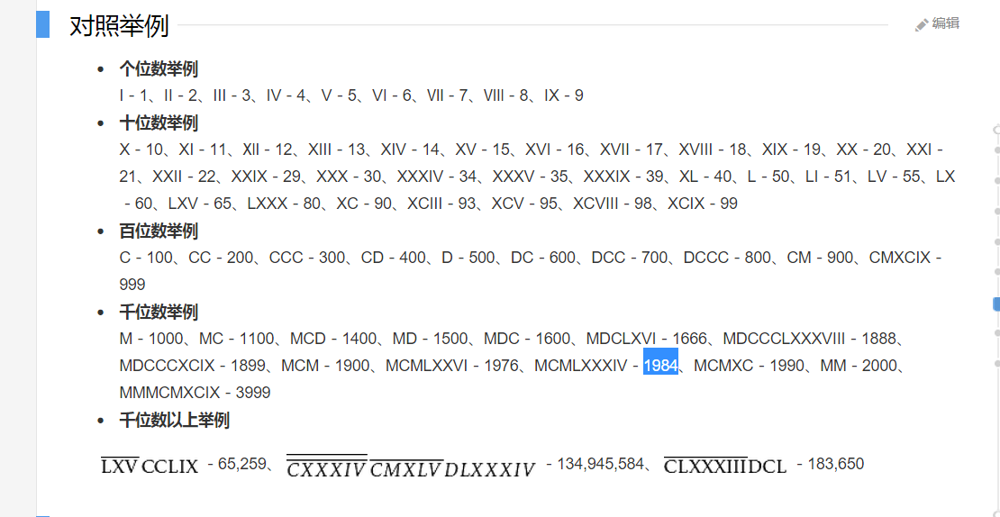

# Integer to Roman（整型数到罗马数）

## 翻译 
给定一个整型数值，将其转换到罗马数字。

输入被保证在 1 到 3999 之间。

## 原文
Given an integer, convert it to a roman numeral.

Input is guaranteed to be within the range from 1 to 3999.

我不会告诉你一开始我是用的无数个变量和 if……

后来实在受不了这么多变量就将其写成了枚举，那么接下来就迎刃而解了。

为了让大家理解罗马数是怎么计数的，这里我截了一张图，具体的大家可以自行用微软 Bing 搜索。



那么代码我就先贴出来了：

```
public class Solution
{
    public string IntToRoman(int num)
    {
        string result = "";
        Type R = typeof(Roman);

        foreach (var r in Enum.GetNames(R).Reverse())
        {
            while (num >= int.Parse(Enum.Format(R, Enum.Parse(R, r), "d")))
            {
                result += r.ToString();
                num -= int.Parse(Enum.Format(R, Enum.Parse(R, r), "d"));
            }
        }
        return result;
    }
}
public enum Roman
{
    M = 1000,
    CM = 900,
    D = 500,
    CD = 400,
    C = 100,
    XC = 90,
    L = 50,
    XL = 40,
    X = 10,
    IX = 9,
    V = 5,
    IV = 4,
    I = 1
};
```

今天晚些时候我会将 C# 枚举的一些用法贴到博客上，不了解的同学敬请关注。

除了枚举的用法外，我认为这道题中需要你去认真了解这些罗马数的规则，也就是说记得将 9 和 4 这种数也添加到枚举中哦。

那么在 IntToRoman 中都中都在做些什么呢？

- 搭配 Type 和 typeof 新建出来 R
- 用 foreach 遍历枚举中的所有元素
- 切记要加上 Reverse()，至于为什么，大家试试不加就知道了
- 如果 num 比枚举中的数字大，则将其对应的字符串（比如说"M”）添加到 result 中
- 最后在 num 中减掉刚才已经用过的数字，数字也通过枚举来获取
- 最后返回 result

好了，到此为止，准备迎接下一题。

下一道题还是关于罗马数的，不过是从罗马数转换成整型数，欢迎大家访问：传送门：[LeetCode 13 Roman to Integer（罗马数到整型数）](http://blog.csdn.net/nomasp/article/details/49154161)。