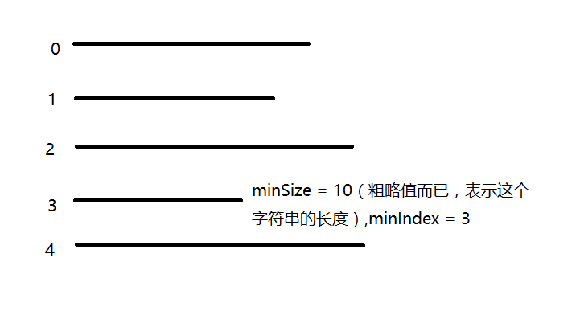

# Longest Common Prefix（最长公共前缀）

## 翻译
写一个函数（或方法）来寻找一个字符串数组中的最长公共前缀。

## 原文
Write a function to find the longest common prefix string amongst an array of strings.

## 释义
"abcdefg"　　　　
"abcdefghijk"　　　　
"abcdfghijk"　　　　
"abcef"　　

上面的字符串数组的最长公共前缀就是"abc"。

## 思考

如下图所示，第一步就是要找出该字符串数组中的最短字符串的长度及其序列。

第二步，用　for　循环从第一个字符串到最后一个字符串依次做比较，具体步骤如下：

- 外层　for　循环中用　i　表示字符串长度，从　minSize　一直可以递减到　0
- 初始 result 即为最短字符串（通过 minIndex 确定）的前 i 个字符
- 内层 for 循环中用j表示字符串数组中的索引，依次递增。j 等于 minIndex 时不做操作（因为为同一个字符串不必比较）
- 否则通过临时字符串 temp 来获取索引为 j 的字符的前 i 个字符
- 需要所有的 temp 都与 result 相等
- 如果 j 和 len 相等了，说明已经遍历完所有的字符串
- 每次判断的字符串长度缩减之后都更新 result



## 代码

```
public class Solution {
    public string LongestCommonPrefix(string[] strs) {
        int len = strs.Length;

        if(len == 0)
            return "";

        string result = "";
        int minSize = 100000;
        int minIndex = 0;

        if(len == 1){
            result = strs[0];
            return result;
        }

        for(int i = 0; i < len; i++){
            int size = strs[i].Length;
            if(size < minSize){
                minSize = size;
                minIndex = i;
            }
        }

        for(int i = minSize; i >= 0; i--){
            result = strs[minIndex].Substring(0,i);

            int j = 0;
            for(; j < len; j++){
                if(j == minIndex)
                    continue;
                string temp = strs[j].Substring(0,i);
                if(result != temp)
                    break;
            }
            if(j == len)
                return result;
        }
        return result;      
    }
}
```