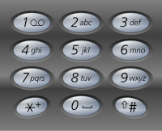

# Letter Combinations of a Phone Number（电话号码的字母组合）

## 翻译 
给定一个数字字符串，返回所有这些数字可以表示的字母组合。

一个数字到字母的映射（就像电话按钮）如下图所示。
  
输入：数字字符串“23”  
输出：["ad", "ae", "af", "bd", "be", "bf", "cd", "ce", "cf"]

备注:尽管以上答案是无序的，如果你想的话你的答案可以是有序的。

## 原图



## 原文
Given a digit string, return all possible letter combinations that the number could represent.

A mapping of digit to letters (just like on the telephone buttons) is given below.

Input:Digit string "23"  
Output: ["ad", "ae", "af", "bd", "be", "bf", "cd", "ce", "cf"].

Note:  
Although the above answer is in lexicographical order, your answer could be in any order you want.

## 代码
看样子我还是用 C# 顺手点，一气呵成……主要是用递归，因为不知道 digits 的长度到底是多少，不可能写无数个 foreach 去判断。

```
public class Solution
{
    IList<string> list = new List<string>();
    public Solution()
    {
        list.Insert(0, "abc");
        list.Insert(1, "def");
        list.Insert(2, "ghi");
        list.Insert(3, "jkl");
        list.Insert(4, "mno");
        list.Insert(5, "pqrs");
        list.Insert(6, "tuv");
        list.Insert(7, "wxyz");
    }
    public IList<string> LetterCombinations(string digits)
    {
        IList<string> result = new List<string>();
        if (digits.Length == 0)
            return result;
        if (digits.Length == 1)
        {
            foreach (var a in list.ElementAt(int.Parse(digits[0].ToString()) - 2))
            {
                result.Insert(0, a.ToString());
            }
        }
        int count = 0;
        IList<string> temp = LetterCombinations(digits.Substring(1, digits.Length - 1));
        foreach (var a in list.ElementAt(int.Parse(digits[0].ToString()) - 2))
        {
            foreach (var rest in temp)
            {
                result.Insert(count++, a.ToString() + rest);
            }
        }
        return result;
    }
}
```

以下是复制来的一段 C++ 代码，坦白地说，我写不出来这样的 C++ 代码……

```
class Solution {
public:
    vector<string> letterCombinations(string digits) {        
        vector<string> ans;
        if(digits.size() == 0)
            return ans;

        int depth = digits.size();
        string tmp(depth, 0);
        dfs(tmp, 0, depth, ans, digits);
        return ans;
    }

    void dfs(string &tmp, int curdep, int depth, vector<string> &ans, string &digits){
        if(curdep >= depth){
            ans.push_back(tmp);
            return ;
        }
        for(int i = 0; i < dic[digits[curdep] - '0'].size(); ++ i){
            tmp[curdep] = dic[digits[curdep] - '0'][i];
            dfs(tmp, curdep + 1, depth, ans, digits);
        }
        return ;
    }
private:
string dic[10] = {{""},{""},{"abc"},{"def"},{"ghi"},{"jkl"},{"mno"},{"pqrs"},{"tuv"},{"wxyz"}};
};
```