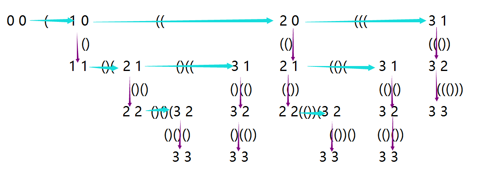

# Generate Parentheses（生成括号）

## 翻译
给定一个括号序列，写一个函数用于生成正确形式的括号组合。  
例如，给定 n = 3，一个解决方案集是：  
"((()))", "(()())", "(())()", "()(())", "()()()"  

## 原文
Given n pairs of parentheses, write a function to generate all combinations of well-formed parentheses.

For example, given n = 3, a solution set is:

"((()))", "(()())", "(())()", "()(())", "()()()"

## 代码

```
class Solution {
public:
    vector<string> result;
    vector<string> generateParenthesis(int n) {
        generate(0, 0, "", n);
        return result;
    }
    void generate(int left, int right, string s, int n) {
        if(right == n) {
            result.push_back(s);
        }
        else
        {
            if(left < n)
            {
                generate(left + 1, right, s + "(", n);
            }
            if(right < left)
            {
                generate(left, right + 1, s + ")", n);
            }
        }
    }
};
```

我自己写的是用排列组合加上第 20 题的代码，有些繁琐不如上面的解法，为了更直观的理解这个递归的过程，就画了下面这个示意图。轻拍……

