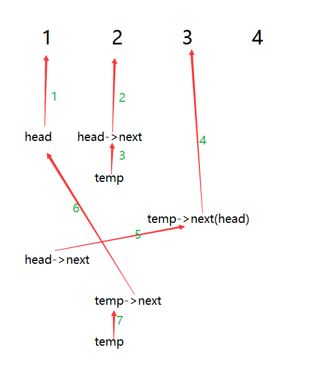

# Swap Nodes in Pairs（交换序列中的结点）

## 翻译
给定一个链表，调换每两个相邻节点，并返回其头部。

例如，  
给定 1->2->3->4， 你应该返回的链表是 2->1->4->3。

你的算法必须使用唯一不变的空间。

你也不能修改列表中的值，只有节点本身是可以改变的。

## 原文
Give a linked list, swap every two adjacent nodes and return its head.

For example,   
Given 1->2->3->4, you should return the list as 2->1->4->3.

Your algorithm should use only constant space. 

You may not modify the values in the list, only nodes itself can be changed.

## 分析
我们就以题目中给出的 1，2，3，4 作为示例，将其作为两部分

1，2 -- 3，4

或者我画个图出来更加直观吧……



## 代码

```
/**
 * Definition for singly-linked list.
 * struct ListNode {
 *    int val;
 *    ListNode* next;
 *    ListNode(int x): val(x), next(NULL) {}
 * };
 */
class Solution {
public:
    ListNode* swapPairs(ListNode* head) {
        if(head == NULL) return NULL;
        if(head->next == NULL) return head;

        ListNode* temp = head->next;
        head->next = swapPairs(temp->next);
        temp->next = head;

        return temp;
    }
};
```